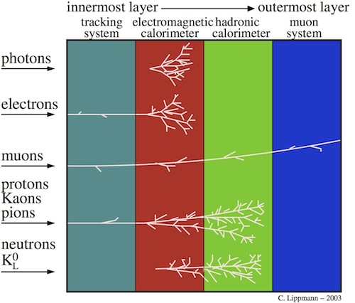

# Particle IDentification

# Source C++ code
in cpp/

copied from https://svnweb.cern.ch/trac/lhcb/browser/packages/trunk/Rec/ChargedProtoANNPIDTeacher

Compilable standalone (provided that you write a correct Makefile). 

#Root files
The ROOT files I use are defined in the various DataFiles at

pciy ~/LHCbCMake/DaVinciDev_v38r0/Rec/ChargedProtoANNPIDTeacher/training/configs > ls training/*TrainingFiles*
training/MC12-TrainingFiles-Bs2MuMu-Cambridge.txt training/MC12-TrainingFiles-Mixture-Cambridge.txt
training/MC12-TrainingFiles-Electrons-Cambridge.txt training/MC12-TrainingFiles-Muons-Cambridge.txt
training/MC12-TrainingFiles-Heavy-Cambridge.txt training/MC12-TrainingFiles-Protons-Cambridge.txt
training/MC12-TrainingFiles-Kaons-Cambridge.txt

These files are all at Cambridge only I am afraid, so you will need to make some copies. I have placed a link to them at

http://www.hep.phy.cam.ac.uk/~jonesc/lhcb/PID/ProtoParticlePIDtuples/

###Feature description
https://docs.google.com/document/d/1tGfWUO80hJEfjPZ-jmo43cRqVehUA_3ctTykRmXjajU/edit

###Some LHCb discussion
https://www.dropbox.com/s/kdpppuayba9ltz3/01003009791.pdf?dl=0
